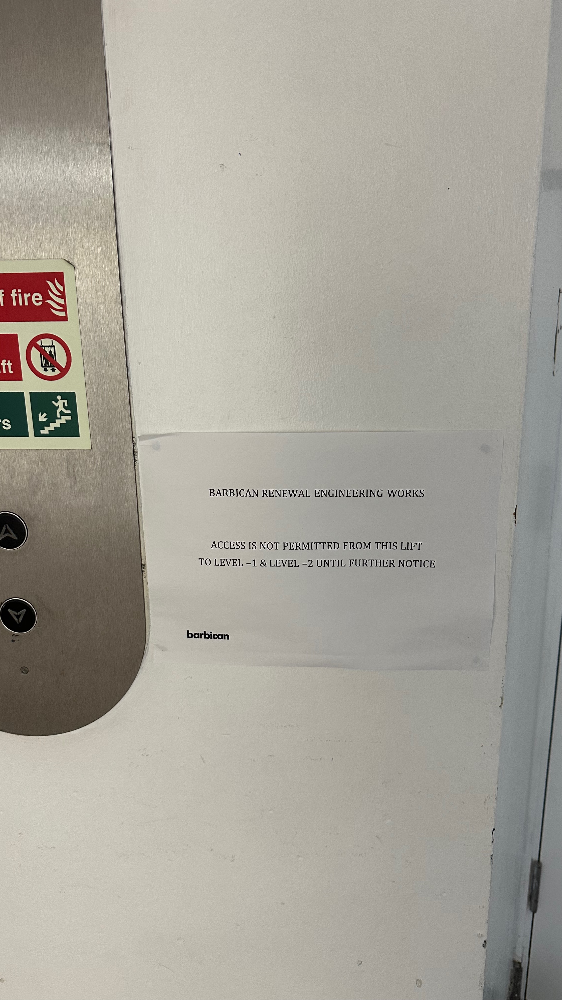
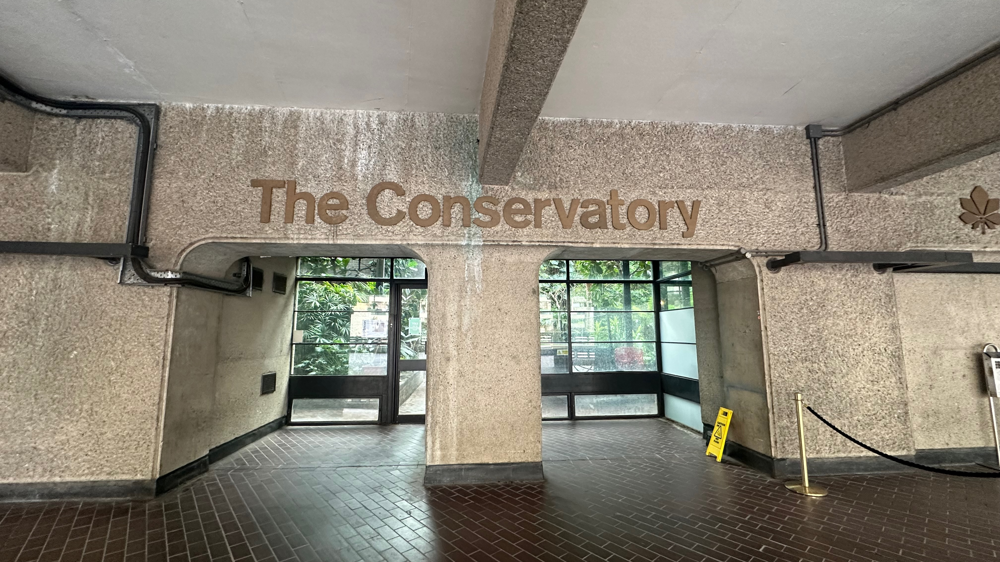
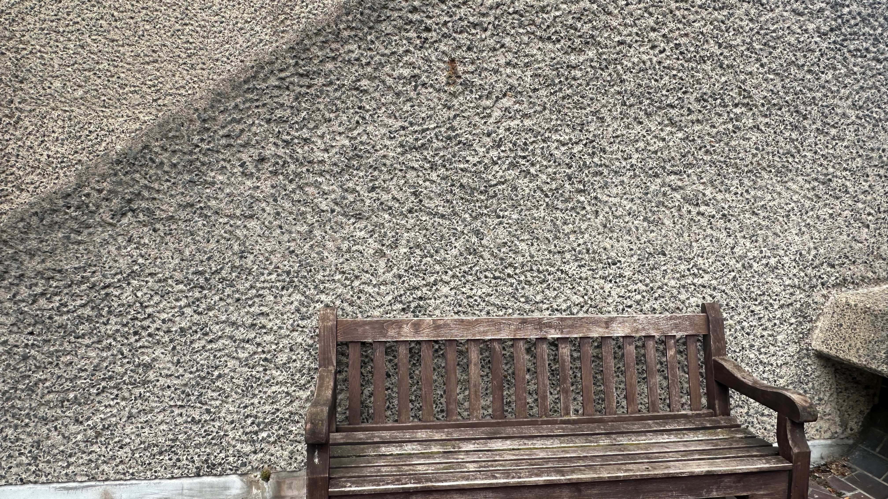
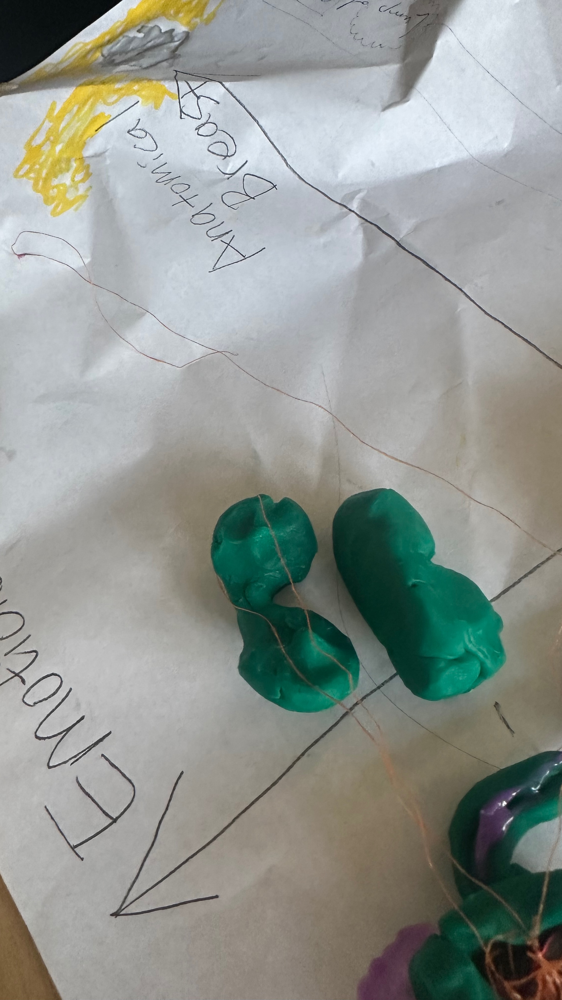
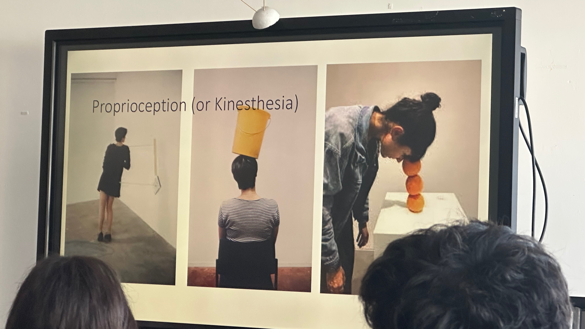
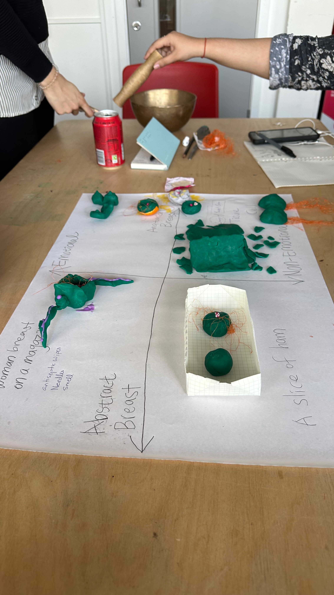
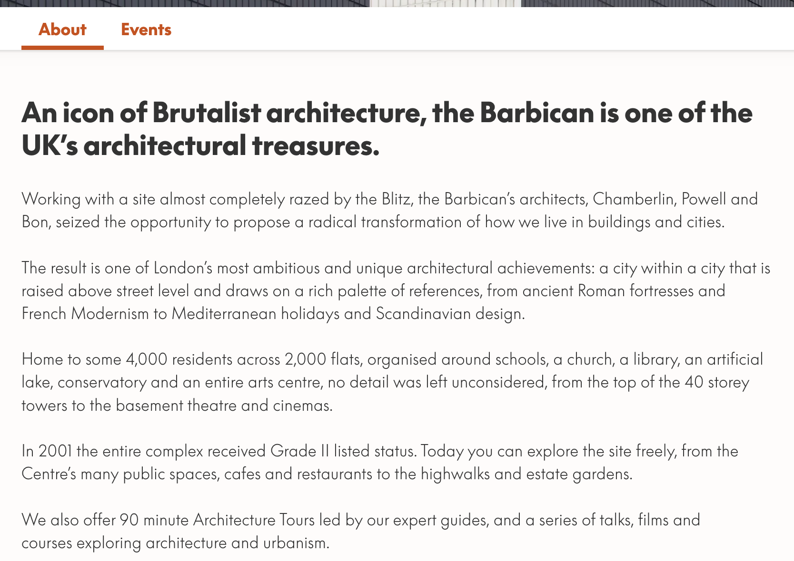
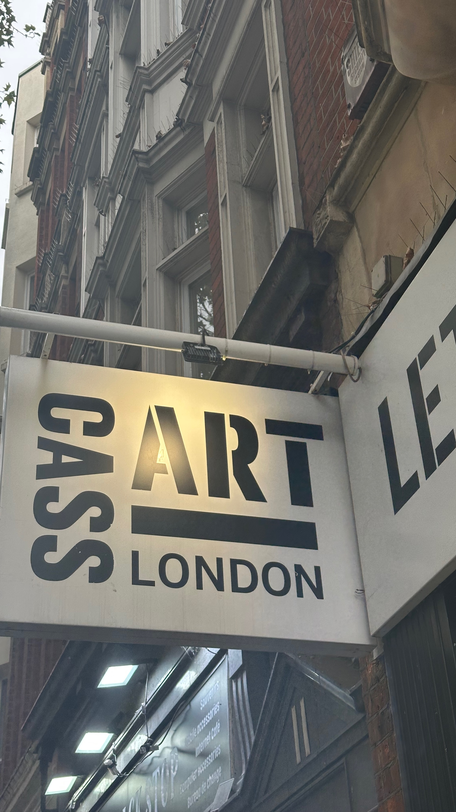
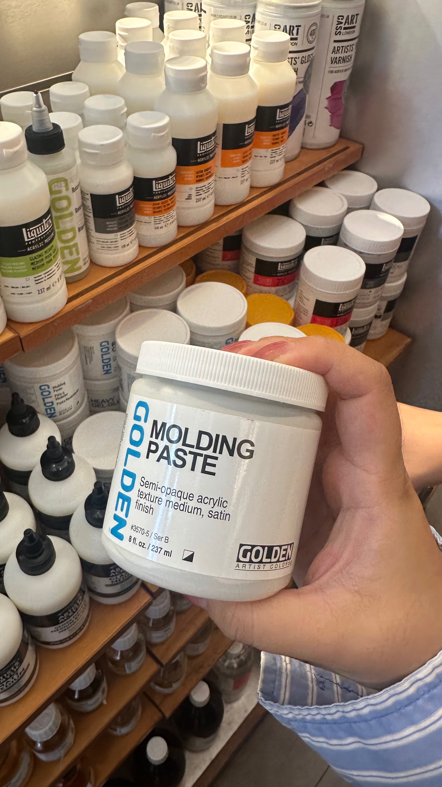

# Project 1 — Weekly Weblog: Barbican Conservatory

## Tuesday, September 22

I visited the Barbican in the morning to begin my research for the project. Since the Conservatory was closed, I explored the surrounding areas instead. I wore my headphones in transparency mode so I could remain aware of the sounds around me while recording them. This made me start thinking about the Barbican as an environment that could be experienced through sound, rather than only through sight.

### Sound Recordings

<audio controls>
  <source src="/audio/week-01/barbican-sound-01.m4a" type="audio/mp4">
  Your browser does not support the audio element.
</audio>

*Field recording 01 — Ambient sounds outside the Barbican.*

<audio controls>
  <source src="/audio/week-01/barbican-sound-02.m4a" type="audio/mp4">
  Your browser does not support the audio element.
</audio>

*Field recording 02 — The water fountain sound from the Conservtory.*

During my visit, I also spoke with Michael Cassidy, who was using an electric wheelchair. I asked about his experience of accessibility at the Barbican and found out that he had previously been the chairman of the Barbican. He gave me a copy of his book, which included a section about living and working at the Barbican. This unexpected conversation gave me another perspective on the space and made me think about how people can experience the same environment differently depending on their needs and how they interact with it.

## Thursday, September 24

When we reviewed our research and presented our findings, I realised that our group had been relying too heavily on sight. Since the project was about exploring a place through different senses, this made me reconsider how we were approaching the brief.

The guest lecture from Aaron McPeake also influenced my thinking. He discussed how differences in pavement materials can help visually impaired people navigate spaces and how sensitive the soles of our feet are. This made me think more about touch and texture as ways of communicating the Barbican.

We were then given the next stage of the project: recreating an experience of the Barbican inside the classroom.

## Friday, September 25

I researched the Barbican further through its website, particularly its architecture and the idea of it being a “city within a city.” This helped me connect the different areas explored by our group. While I had focused on the Arts Centre and other group members had explored the residential areas, they were still part of the same larger environment.

From this research and our different experiences, we began developing the idea of **contrast**. We started thinking about how the differences between the residential and Arts Centre areas could be communicated.

## Sunday, September 27

We had a short group meeting in the afternoon, but there was some misunderstanding about its purpose. I thought we were discussing materials for the classroom experience, while others thought we were revisiting the prototype. This highlighted the importance of clear communication and agreeing on our goals before moving forward.

After the meeting, I briefly visited an art supply shop to look at some possible materials and textures that we could use for the classroom experience. 